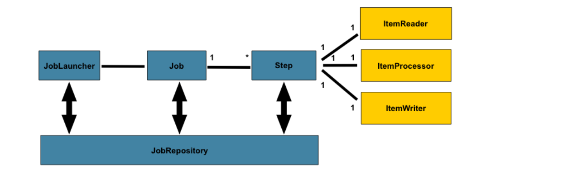
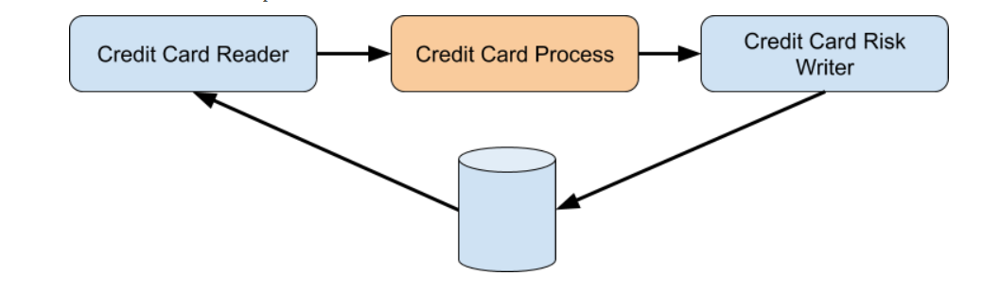

# SPRING BATCH with JPA EXAMPLE

We will be to create a Job that reads from a table containing credit cards, then when processing them determine the risk of the card based on an alleged payment date, and at the end save another entity with the result.**

Steps:

1) Read credit cards from the database
2) Process the cards and apply a business rule for those cards: calculate the risk of the card according to the payment date.
 The process must generate a new entity with the result of the risk
3) In the end, the process result is saved

## Guide

To Launch H2 Console:  
http://localhost:8080/h2-console/l

To Trigger JOB via rest endpoint  
http://localhost:8080/triggerJob

